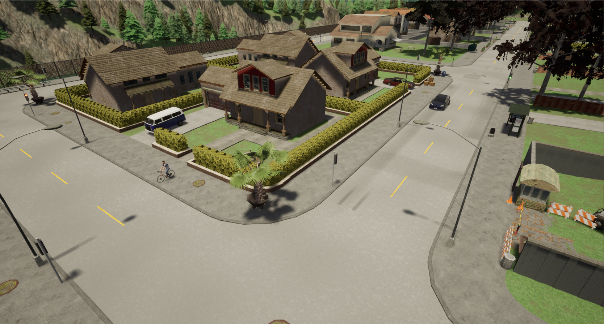
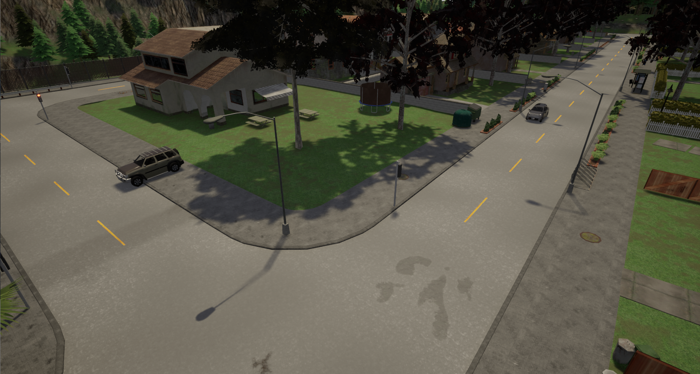
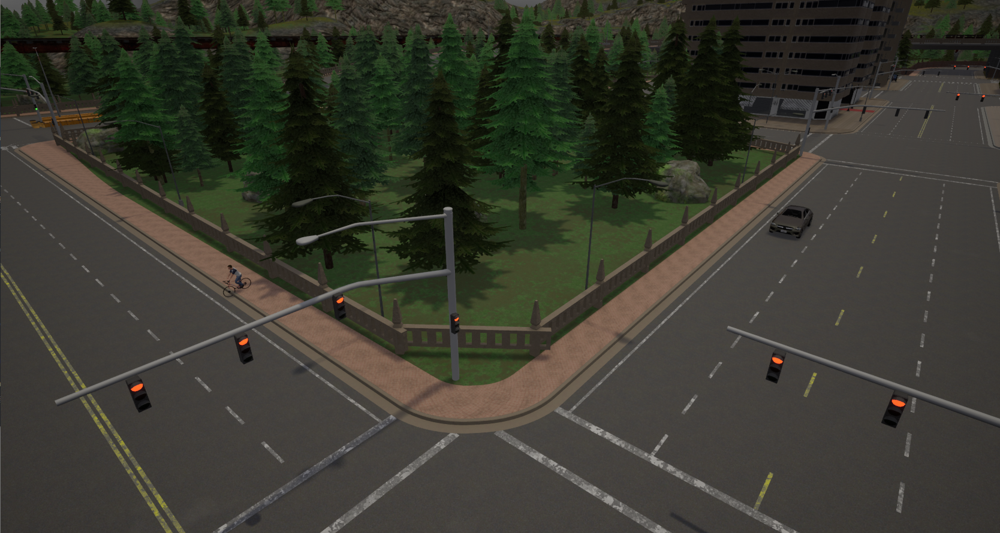
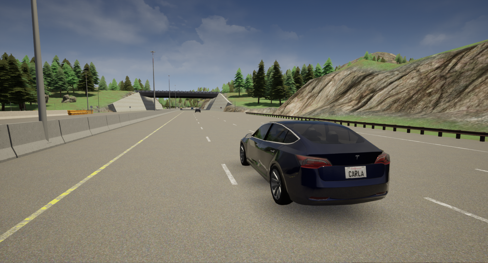
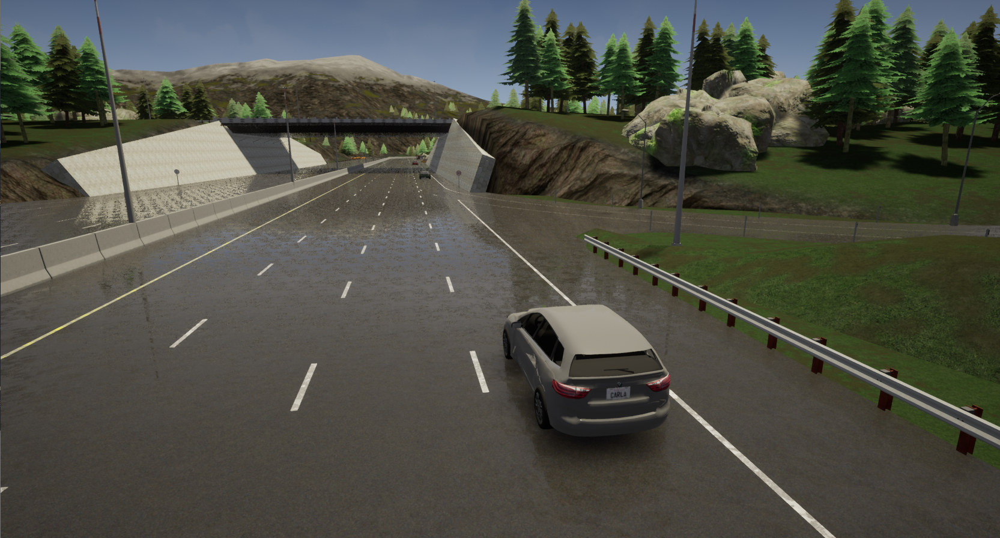
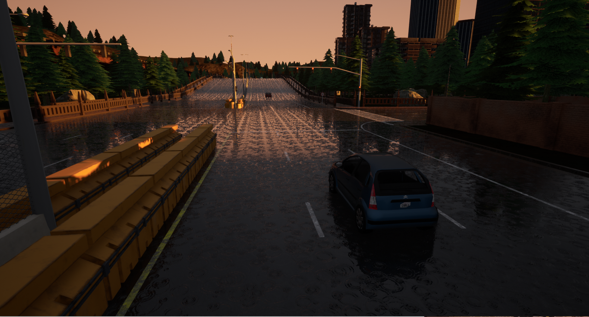

# 3DCV project on critical driving scenarios

Christopher Klammt  
Tobias Richstein  
Julian Seibel  
Karl Thyssen

[Link to the report](report/report.pdf)

## Scenario generation

For starting the scenario generation, make sure to install all requirements using the *environment.yml* i.e. with conda:

`` conda env create -f environment.yml ``

Afterwards, make sure to place all basic scenarios in the *./scenario_generation/basic_scenarios/* folder as *xosc* OpenSCENARIO configuration files.

Start the process by executing the following command from the root folder:

``python ./scenario_generation/openSCENARIO_generator.py [--log] [--number_scenarios] [--save_path]``

Explanation of the arguments:
* ``logs`` : Flag, if logging is activated. The generator will save a csv file in *./logs/* per basic scenario including all new values set for newly generated scenarios
* ``number_scenarios`` : The number of scenarios which should be created out of one basic scenario (*default* is 1)
* ``save_path`` : Folder where to save the generated scenarios (*default* is *./generated_scenarios/*)

Below are some examples of newly generated scenarios compared to the original scenario.

### Cyclist scenario

Above is the original blueprint for the cyclist scenario. It features a hero car and a bike that is about to cross the street forcing the car to brake.

---

This is a modified scenario of the cyclist crossing. The bike has been replaced with a car and the situation occurs at a different intersection but within the same map.

---

For this scenario the town has changed but the parameters of the situation remain the same.

### Lane Changing Scenario

This scenario describes the hero car following a car driving in front that abruptly changes its lane to avoid a still standing vehicle.

---

This generated scenario takes place in rougher weather and also features the highway going in the other direction than in the original and also using a different lane.

---

Above we can see a generated lane changing scenario taking place in a different town from the original scenario.
